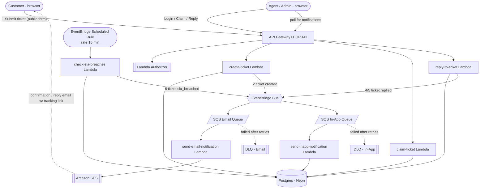

# App / event flow

Numbers in the flow labels correspond to the step numbers in [PRD.md § End-to-end flow](../../PRD.md#end-to-end-flow). Steps 3 (claim) and 7 (close) intentionally have no arrows into EventBridge — no event is fired for either, per that decision.
