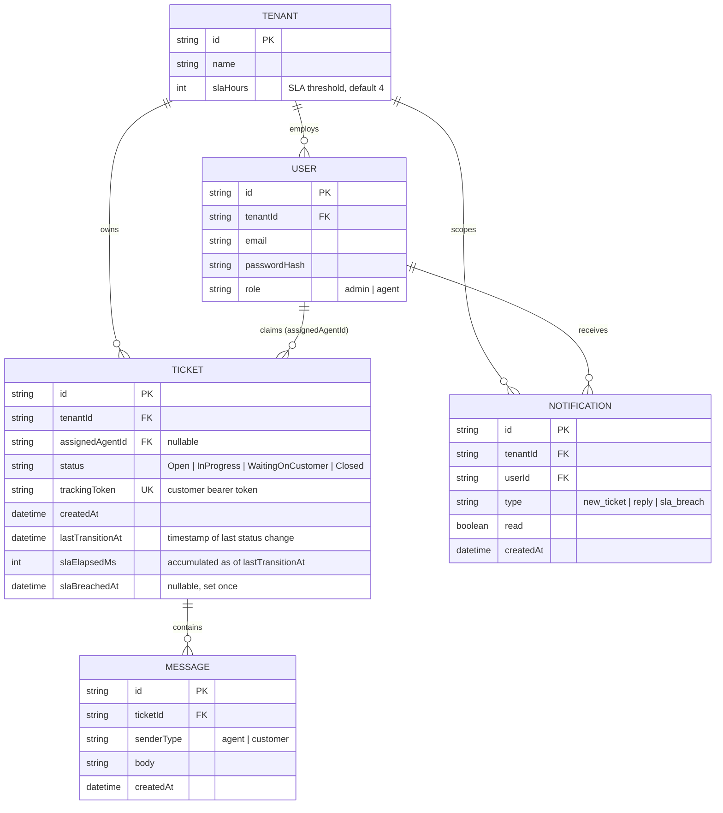

# Database schema

`slaElapsedMs` + `lastTransitionAt` together implement the SLA formula from [`CONTEXT.md`](../../CONTEXT.md): current elapsed time = `slaElapsedMs + (now - lastTransitionAt)` while status is `Open`/`InProgress`, frozen otherwise.
